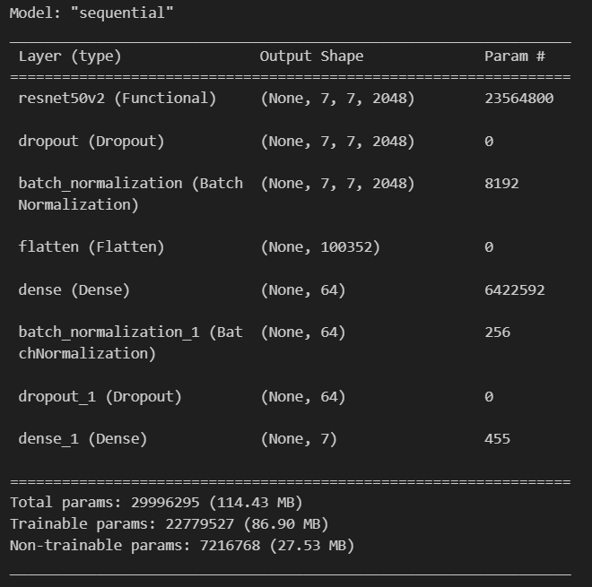
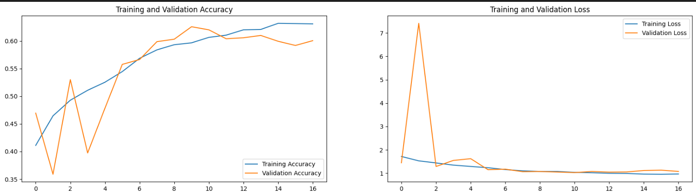
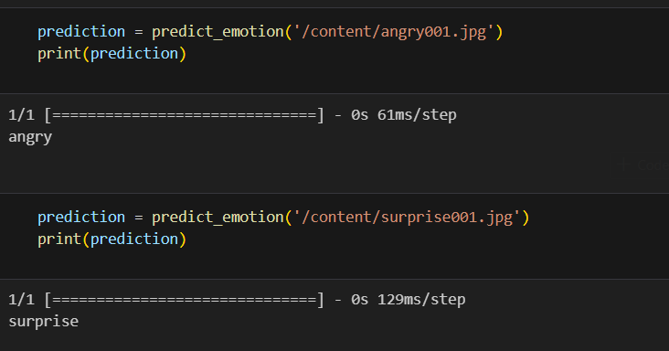

# Emotion Detection Project

This project aims to detect emotions from images using deep learning techniques. We explored four different approaches: a custom CNN model, a custom CNN model with data augmentation, transfer learning using VGG16, and transfer learning using ResNet50. Among these approaches, the ResNet50 model performed the best.

## Approaches and Results

### 1. Custom CNN Model
#### Approach
- Designed a custom Convolutional Neural Network (CNN) from scratch.
- The architecture included convolutional layers, pooling layers, activation functions (e.g., ReLU), and fully connected layers.

#### Challenges
- The model suffered from overfitting, where it performed well on the training data but poorly on the validation data.
- The F1 score for the "disgust" class was 0 due to the very few images available for this class (Imbalance Data).

#### Performance
- **Final Train Accuracy**: 93.60%
- **Final Validation Accuracy**: 61.88%
- F1 score for "disgust": 0

### 2. Custom CNN Model with Data Augmentation
#### Approach
- Implemented data augmentation techniques to increase the diversity of the training data.
- Techniques included random rotations, shifts, flips, and other transformations.

#### Improvements
- Data augmentation helped in reducing overfitting.
- Overall performance improved, but the F1 score for the "disgust" class remained low due to the limited number of images (Imbalance Data).

#### Performance
- **Final Train Accuracy**: 57.93%
- **Final Validation Accuracy**: 58.23%
- F1 score for "disgust": 0

### 3. Transfer Learning using VGG16
#### Approach
- Employed transfer learning with the VGG16 model, pre-trained on the ImageNet dataset.
- All layers except the last three were frozen to retain the pre-trained weights.
- Additional dense layers were added on top, and the model was trained on the emotion dataset.

#### Improvements
- Performance improved across most classes.
- The model could classify 7-10 images in the "disgust" class correctly.

#### Performance
- **Final Train Accuracy**: 55.93%
- **Final Validation Accuracy**: 55.00%
- F1 score for "disgust": Improved somewhat but not optimal.

### 4. Transfer Learning using ResNet50
#### Approach
- Utilized the ResNet50 model for transfer learning.
- The architecture included adding custom dense layers on top of the pre-trained ResNet50 model.
- The model was fine-tuned on the FER-2013 dataset.

#### Model Architecture

#### Significant Improvements
- The ResNet50 model showed significant improvement in F1 scores for all classes.
- The architecture and pre-trained weights of ResNet50 contributed to better feature extraction and classification.

#### Performance
- **Final Train Accuracy**: 63.48%
- **Final Validation Accuracy**: 62.58%
- **Classification Report**: Improved F1 scores across all classes.

## Classification Report (ResNet50)

| Class    | Precision | Recall | F1-Score |
|----------|-----------|--------|----------|
| Angry    | 0.56      | 0.58   | 0.57     |
| Disgust  | 0.45      | 0.69   | 0.54     |
| Fear     | 0.50      | 0.25   | 0.34     |
| Happy    | 0.89      | 0.82   | 0.85     |
| Neutral  | 0.55      | 0.66   | 0.60     |
| Sad      | 0.48      | 0.56   | 0.51     |
| Surprise | 0.70      | 0.77   | 0.73     |
| **Overall** |           |        |          |
| Accuracy |           |        | 0.63     |
| Macro Avg| 0.59      | 0.62   | 0.59     |
| Weighted Avg| 0.63   | 0.63   | 0.62     |
## Conclusion

The project highlights the journey from basic custom models to sophisticated transfer learning techniques. The ResNet50 model significantly outperformed the other approaches, demonstrating the value of deep learning and transfer learning in complex tasks like emotion detection. The classification report reflects the effectiveness of the ResNet50 model, with notable improvements in F1 scores across all emotion classes.

## Results and Sample Predictions

### Model Training

### Sample Prediction
| Angry Image | Surprise Image |
|----------|-----------|
|  |  |

### Prediction Output

## Future Work
- **Further Data Augmentation**: Experiment with more advanced data augmentation techniques to improve performance on minority classes.
- **Hyperparameter Tuning**: Perform extensive hyperparameter tuning to further enhance model accuracy and robustness.
- **Ensemble Methods**: Explore ensemble methods to combine the strengths of multiple models.

